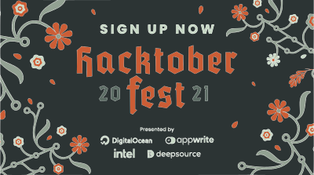

[](https://github.com/ellerbrock/open-source-badges/)
[](https://opensource.org/licenses/mit-license.php)
[](CONTRIBUTING.md)
[](http://makeapullrequest.com)
[](https://twitter.com/Niweera)
[](https://github.com/Niweera/cinesimile/actions)
[](https://simile.znbt.ml/)
[](https://GitHub.com/Niweera/cinesimile/network/)
[](https://GitHub.com/Niweera/cinesimile/stargazers/)
[](https://GitHub.com/Niweera/cinesimile/watchers/)
[](https://GitHub.com/Niweera/cinesimile/graphs/contributors/)
[](https://GitHub.com/Niweera/cinesimile/issues/)
[](https://GitHub.com/Niweera/cinesimile/issues?q=is%3Aissue+is%3Aclosed)
[](https://GitHub.com/Niweera/cinesimile/pulls/)
[](https://GitHub.com/Niweera/cinesimile/pulls/)
[](https://www.codetriage.com/niweera/cinesimile)
<br><br>
[](https://simile.znbt.ml/)
[](https://simile.znbt.ml/)
[](https://simile.znbt.ml/)
[](https://simile.znbt.ml/)
[](https://simile.znbt.ml/)

<h1 align="center"> CineSimile </h1>
<p align="center"> For All Your Movie Recommendation Needs! </p>
<br>

<h1 align="center"> Hacktoberfest Notice </h1>



Hacktoberfest 2020 is finally here and we very much welcome your wonderful contributions! You can win a Hacktoberfest T-Shirt as a token of appreciation. Visit https://hacktoberfest.digitalocean.com/ and check out how to contribute to open source and be an open source hero! 😁

## About The Project

CineSimile is a platform where you can find similar movies for a given movie. Currently, we are in the phase of finding similarity between the movies. So keep in touch, and we'll let you know.

### Machine Learning

Cinesmile is powered by machine learning to enhance the search capabilities and find a closer fit to your movie of choice. Similar technology is used by Netflix and Youtube to tailor recommendations to your personal choices.

### Technology Used

- Carbon Design System - https://www.carbondesignsystem.com/all-about-carbon/what-is-carbon

- React - https://reactjs.org/

- Docker - https://www.docker.com/why-docker

## Getting Started

Thank you for showing interest in CineSimile, an open sourced platform to find similar movies. Please follow the steps and you'll soon end up being an open source contributor 😎. Please read the [CONTRIBUTING](https://github.com/Niweera/cinesimile/blob/master/CONTRIBUTING.md) document before starting to contribute to this project.

1. [Fork](https://github.com/Niweera/cinesimile/fork) the repository.

2. Clone the repository to your machine.

   ```bash
   $ git clone https://github.com/<username>/cinesimile.git
   ```

3. Install node_modules.

   ```bash
   $ npm ci
   ```

4. Start the React development server.

   ```bash
   $ npm start
   ```

5. Do something amazing (FYI, pick an issue from the [issue list](https://github.com/Niweera/cinesimile/issues), and add a comment stating that you're going to work on it.)

6. Commit and push the changes.

   ```bash
   $ git add .

   $ git commit -m "your commit message (make it meaningful and short)"

   $ git push origin master
   ```

7. Finally, create a [pull request](https://www.youtube.com/watch?v=OHV64qh-uyY).

## 🐳 Run through Docker (Optional)

If interested in learning more about docker. [Docker Introduction](https://docs.docker.com/get-started/)

1. Execute the command below if you have the Docker CLI in your machine or server:

   ```sh
   docker-compose up
   ```

2. Open in your browser.

   ```sh
   - localhost
   OR
   - 0.0.0.0
   ```

3. Access the portainer to see the logs (optional)
   ```sh
   - localhost:9000
   OR
   - 0.0.0.0:9000
   ```
   Do the follow steps to use the Portainer:
   1. You'll need to create a password for local admin account.
   2. Choose the option: "**Docker** _manage the local Docker environment_".
   3. Done, you're now able to manage the containers

## Additional Information

9. If you are creating a new pull request please update your fork.

   ```bash
   $ git pull upstream master
   ```

Do this before creating another pull request. By doing this, your fork will be up-to-date with the main repository.

## Running E2E Tests 🧪

1.  Running Tests Manually Using Cypress Test Runner

    ```bash
    npm run cy:run_in_dev
    ```

    Note: If the app server is already running, run: `npm run cy:open`

2.  Running All Tests in Headless Mode

    ```bash
     npm run cy:run_in_ci
    ```

    Note: If the app server is already running, run: `npm run cy:run`

3.  Running Specific Test in Headless Mode

    ```bash
    // replace <test_name> with the test file name

    npm run cy:run --spec "cypress/integration/<test_name>.spec.js"
    ```

<hr>

Spread the word, help your friends to get a Hacktoberfest T-Shirt too! 😁
<br>
Good luck with your open source journey.

Happy Hacking! 😁

## License

Distributed under the MIT License. See [LICENSE](https://github.com/Niweera/cinesimile/blob/master/LICENSE) for more information.
