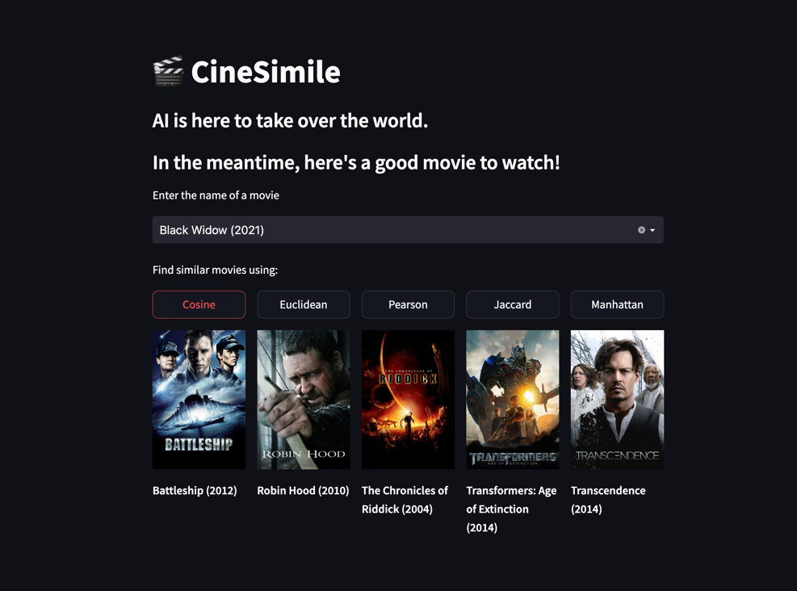

[](CONTRIBUTING.md)
[](https://github.com/ellerbrock/open-source-badges/)
[](https://opensource.org/licenses/mit-license.php)
[](http://makeapullrequest.com)
[](https://cinesimile.niweera.com/)
[](https://GitHub.com/Niweera/cinesimile/network/)
[](https://GitHub.com/Niweera/cinesimile/stargazers/)
[](https://GitHub.com/Niweera/cinesimile/watchers/)
[](https://GitHub.com/Niweera/cinesimile/graphs/contributors/)
[](https://GitHub.com/Niweera/cinesimile/issues/)
[](https://GitHub.com/Niweera/cinesimile/issues?q=is%3Aissue+is%3Aclosed)
[](https://GitHub.com/Niweera/cinesimile/pulls/)
[](https://GitHub.com/Niweera/cinesimile/pulls/)
<br><br>
[](https://cinesimile.niweera.com/)
[](https://cinesimile.niweera.com/)
[](https://cinesimile.niweera.com/)
[](https://cinesimile.niweera.com/)
[](https://cinesimile.niweera.com/)

<h1 align="center"> 🎬 CineSimile </h1>
<p align="center"> AI is here to take over the world. In the meantime, here's a good movie to watch!  </p>
<br/>



## About The Project

CineSimile is a platform where you can find similar movies for a given movie.
Now online at [cinesimile.niweera.com](https://cinesimile.niweera.com/).

### Machine Learning

CineSimile is powered by machine learning to enhance the search capabilities and find a closer fit to your movie of choice. Similar technology is used by Netflix and Youtube to
tailor recommendations to your personal choices.

### Technology Used

- Streamlit - https://streamlit.io/
- Python

## Getting Started

Thank you for showing interest in CineSimile, an open sourced platform to find similar movies for a given movie. Please follow the steps and you'll soon end up being an open source
contributor and become a part of the Open Source Community😎. Please read the [CONTRIBUTING](https://github.com/Niweera/cinesimile/blob/master/CONTRIBUTING.md) document before
starting to contribute to this project and learn about the intricacies of Contributing.

1. [Fork](https://github.com/Niweera/cinesimile/fork) the repository.

2. Clone the repository to your Local machine.

   ```bash
   $ git clone https://github.com/<username>/cinesimile.git
   ```

3. Install Python packages.

   ```bash
   $ python3 -m pip install -r requirements.txt
   ```

4. Start the React development server.

   ```bash
   $ streamlit run app.py
   ```

5. Do something amazing and Creative(FYI, pick an issue from the [issue list](https://github.com/Niweera/cinesimile/issues), and add a comment stating that you're going to work on
   it.)

6. Commit and push the changes.

   ```bash
   $ git add .

   $ git commit -m "your commit message (make it meaningful and short)"

   $ git push origin master
   ```

7. Finally, create a [pull request](https://www.youtube.com/watch?v=OHV64qh-uyY).

## Additional Information

9. If you are creating a new pull request please update your fork.

   ```bash
   $ git pull upstream main
   ```

Do this before creating another pull request. By doing this, your fork will be up-to-date with the main repository.

## License

Distributed under the MIT License. See [LICENSE](https://github.com/Niweera/cinesimile/blob/master/LICENSE) for more information.

### Special thanks to [Dr. Adarsh Prasad Behera](https://scholar.google.com/citations?user=ce1y_FMAAAAJ&hl=en&oi=ao).
